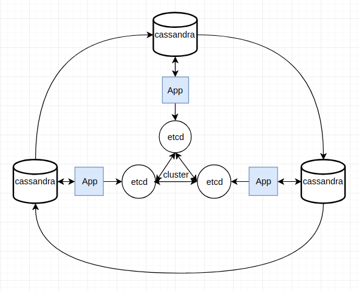

url shorten
===========
Url shorten is an application that map long url to short one. is use Etcd as a coordinator and [**Cassandra**](http://cassandra.apache.org/) or [**Mariadb**](https://mariadb.org/) as it's dataStore(It's depend on your business size).
so you can scale service up very easy.
this application use **Base62** to create short url based on distributed sequence number and store [MD5](https://en.wikipedia.org/wiki/MD5) for each origin URL to avoid from data duplication.



feature list
------------
- (OK) Get range counter from etcd
- (OK) Commit used counter and recover that from etcd
- (OK) Check link md5 to avoid data duplication
- (OK) Rest API with JWT support
- (OK) Register new URL
- (OK) Define custom token for specific URL
- (OK) fetch page title
- (OK) Toml base configurable service
- (OK) Generate user friendly log with configurable log level
- (OK) Use Cassandra or MariaDB as a backend database
- specific counter range for specific domain
- set custom header in redirect

Installation
------------
put `config.toml` near application binary or specify `-config` flag. the configuration file must contain
```toml
rest_api_port=":9001" #Rest api interface and port listen on
debug_port=":6060"
api_secret_key="secret key"

[log]
log_level="debug"     #debug/info/warning/error (default: warning)
format="text"         #json/text (defualt: text)
log_dst="/path/to/dest/file.log" #Optional

# must contain mariadb configuration or cassandra as datastore
[mysql]
address="127.0.0.1:3306" #optional (default: 127.0.0.1:3306)
username="root"     #optional (default: root)
password="123"
db="tiny_url"
max_ideal_conn=10   #Optional (default: 10)
max_open_conn=20    #Optional (default: 10)

[cassandra]
address="127.0.0.1:9042,127.0.0.1:9045" #optional (default: 127.0.0.1:9042)
username="root"
password="123"
keyspace="tinyurl"

[etcd]
address="http://127.0.0.1:2379"
root_key="/service" #All application services must be regiter under the same domain
node_id="node1"     #Each application node must have unique node_id
```

Rest API
--------
the REST API are Jwt support so you must login first and then use your token to send rest of your commands

|URL|type|Description|
|---|---|---|
|`<DOMAIN>/<short-token>`|GET|redirect to origin url|
|`<DOMAIN>/login`|POST|login and get your specific token to communicate with|
|`<DOMAIN>/api/v1/register/url`|POST|Get a short url for specific domain|

Debugging
---------
Debugging rest APIs

- http://`<SERVER_IP>:<debug_port>`/debug/pprof/goroutine
- http://`<SERVER_IP>:<debug_port>`/debug/pprof/heap
- http://`<SERVER_IP>:<debug_port>`/debug/pprof/threadcreate
- http://`<SERVER_IP>:<debug_port>`/debug/pprof/block
- http://`<SERVER_IP>:<debug_port>`/debug/pprof/mutex
- http://`<SERVER_IP>:<debug_port>`/debug/pprof/profile
- http://`<SERVER_IP>:<debug_port>`/debug/pprof/trace?seconds=5

Call `http://<SERVER_IP>:<debug_port>/debug/pprof/trace?seconds=5` to get 5 second of application trace file and then you can see application trace. With
`go tool trace <DOWNLOADED_FILE_PATH>` command you can see what's happen in application on that period of time

Call `http://<SERVER_IP>:<debug_port>/debug/pprof/profile` to get service profile and then run `go tool pprof <DOWNLOADED_FILE_PATH>` command go see more details about appli   cation processes

To get more inform
